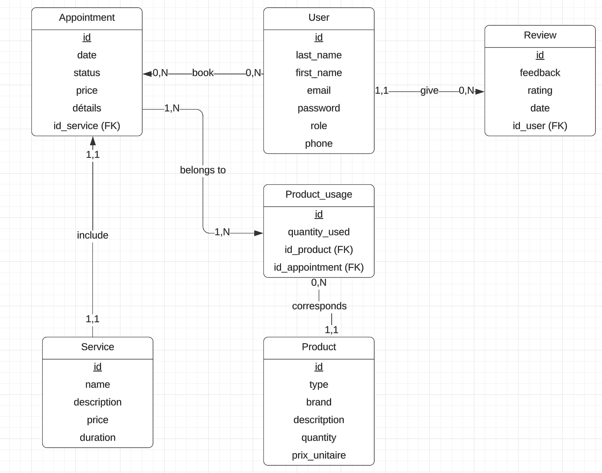

# BookMyCut

### Choix du projet
**BookMyCut** est une application web développée avec Symfony 7 et PHP 8.3, utilisant Docker pour l'environnement de développement. Elle s'adresse aux salons de coiffure désirant gérer leurs rendez-vous et leur stock de produits simplement. 

### User Stories 
US1. En tant que client, je veux créer un compte et m'y authentifier afin de prendre rendez-vous.  
- [ ] Lorsque je suis sur la page "Inscription", quand j'ai rempli le formulaire et que je clique sur le bouton "S'inscrire", alors je peux me connecter à mon compte. 
- [ ] Lorsque je suis sur la page "Connexion", quand j'ai rempli mon email, mon mot de passe et que je clique sur le bouton "Connexion", alors je suis connectée et je peux prendre rendez-vous. 
US2. En tant que client, je veux avoir des informations sur les prestations afin de choisir ma prestation.  
- [ ] Lorsque je suis sur la page d'accueil, quand je clique sur "Services", alors je peux voir tous les services disponibles. 
US3. En tant que client, je veux réserver une prestation afin d'obtenir ma prestation.  
- [ ] Lorsque je suis sur la page "services" et que j'ai chosi ma prestation, quand je clique sur "Réserver", alors je suis sur la page "Réservations".
- [ ] Lorsque je suis sur la page "Réservations", quand je chosis une date et une heure, alors je peux cliquer sur "Confirmer votre rendez-vous". 
- **Coiffeur :**
- Création et authentification à un compte administrateur
- Accès à un agenda avec les rendez-vous (CRUD)
- Gestion du stock avec génération d'une liste de courses (coupe homme : 1/3 shampoing, coupe femme : 1/2 shampoing)
- Accès à une estimation du chiffre d'affaires mensuel

### Schéma de la base de données

- 1 table utilisateur (client et coiffeur)
- 1 table rendez-vous (date, horaire, prestation)
- 1 table prestation (nom, produit nécessaire, quantité nécessaire)
- 1 table stock (produit, quantité)

### Maquettes avec Figma
https://www.figma.com/design/pfgxXrqYAUlA0grtzf6oOq/Untitled?node-id=0-1&m=dev&t=hiGhsBEL2okKY0sN-1

### Choix de l'outil de gestion de projet
Trello : https://trello.com/invite/b/679673e0da344137f1ead289/ATTI4f90adfb3a82eb787abb607306fe39bbC7262E66/bookmycut 
